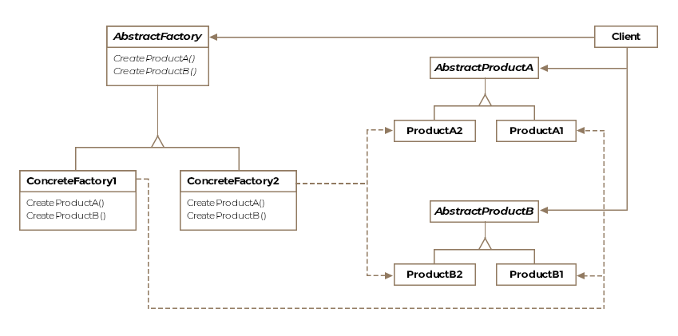

# Abstract Factory - Object Creational

## Intent
Provide an interface for creating families of related or dependent objects without specifying their concrete classes

## Applicability
Use this pattern when:
* a system should be independent of how its products are created, composed, and represented
* a system should be configured with one of multiple families of products
* a family of related product objects is designed to be used together, and you need to enforce this constraint
* you want to provide a class library of products, and you want to reveal just their interfaces, not their implementations

## Structure

## Participants
* AbstractFactory
  * declares an interface for operations that create abstract product objects
* ConcreteFactory
  * implements the operations to create concrete product objects
* AbstractProduct
  * declares an interface for a type of product object
* ConcreteProduct
  * defines a product object to be created by the corresponding concrete factory
  * implements the AbstractProduct interface
* Client
  * uses only interfaces declared by AbstractFactoroy and AbstractProduct classes

## Collaborations
* Normally a single instance of a ConcreteFactory class is created at run-time. This concrete factory creates product objects having a particular implementation. Tocreate different product objects, clients should use a different concrete factory
* AbstractFactoryr defers creation of product objects to its ConcreteFactory subclass

## Consequences
* It isolates concrete classes
* It makes exchanging product families easy
* It promotes consistency among products
* Supporting new kinds of products is difficult

## Implementation
* Factories as singletons
  * an application typically needs only one instance of a ConcreteFactory per product family
* Creating the products
  * Using Factory Method
    * define a factory method for each product
    * simple implementation
    * requires a new ConcreteFactory subclass for each product family, even if the product families differ only slightly
  * Using Prototype
    * ConcreteFactory initialized with prototytpical instance of each product in the family and creates a new product by cloning its prototype
    * eliminates the need for a new ConcreteFactory class for each new product family
* Defining extensible factories
  * 

## Related Patterns
* Factory Method
  * AbstractFactory classes often implemented with Factory Methods = Factory Methods -> AbstractFactory class
* Prototype
  * AbstractFactory class sometimes implemented with Prototype = Prototype -> AbstractFactory class
* Singleton
  * concrete factories often implemented as Singletons = Singleton -> concrete factory