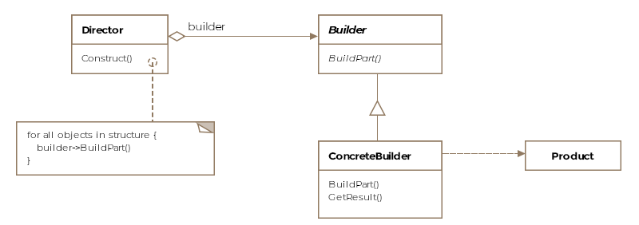

# Builder - Object Creational

## Intent
Separate the construction of a complex object from its representation so that the same construction process can create different representations

## Applicability
Use this pattern when:
* the algorithm for creating a complex object should be independent of the parts that make up the object and how they're assembled
* the construction process must allow different representations for the object that's constructed

## Structure

## Participants
* Builder
  * specifies an abstract interface for creating parts of a Product object
* ConcreteBuilder
  * constructs and assembles parts of the product by implementing the Builder interface
  * defines and keeps track of the representation it creates
  * provides an interface for retrieving the product
* Director
  * constructs an object using the Builder interface
* Product
  * represents the complex object under construction. ConcreteBuilder builds the product's internal representation and defines the process by which it's assembled
  * includes classes that define the constituent parts, including interfaces for assembling the parts into the final result

## Collaborations
* The client creates the Directoro object and configures it with the desired Builder object
* Director notifies the builder whenever a part of the product should be built
* Builder handles requests from the director and adds parts to the product
* The client retrieves the product from the builder

## Consequences
* It lets you vary a product's internal representation
* Iit isolates code for construction and representation
* It gives you finer control over the construction process

## Implementation
* Assembly and construction interface
* Why no oabstract class for products?
* Empty methods as default in Builder

## Related Patterns
* Abstract Factory
  * also may construct complex objects
  * Builder constructs complex object step by step while Abstract Factory focuses on families of product objects (either simple or complex) and returns them immediately
* Composite
  * what the Builder often builds