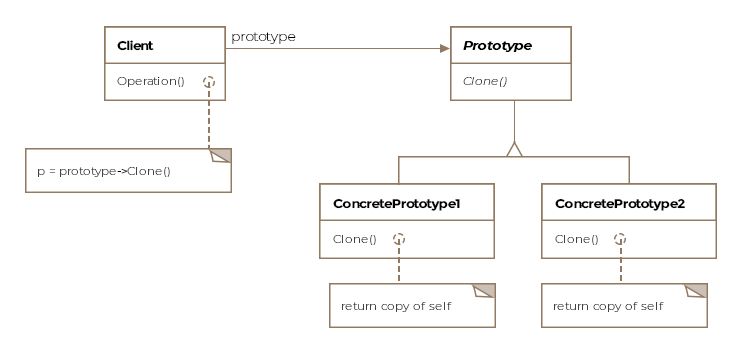

# Prototype - Object Creational

## Intent
Specify the kinds of objects to create using a prototypical instance, and create new objects by copying this prototype

## Applicability
Use this pattern when:
* a system should be independent of how its products are created, composed, and represented; AND
* when the classes to instantiate are specified at run-time, for example, by dynamic loading; OR
* to avoid building a class hierarchy of factories that parallels the class hierarchy of products; OR
* when instances of a class can have one of only a few different combinations of state. It may be more convenient to install a corresponding number of prototypes and clone them rather than instantiating the class manually, each time with the appropriate state

## Structure

## Collaborations
* A client asks a prototype to clone itself

## Consequences
* similar consequences to Abstract Factory and Builder
* adding and removing products at run-time
* Specifying new objects by varing values
* Specifying new objects by varying structure
* Reduced subclassing
* Configuring an appliciation with classes dynamically

## Implementation
* Using a prototype manager
* Implementing the Clone operation
* Initializing clones

## Related Patterns
* Composite + Decoratoro
  * designs that make heavy use of Composite and Decorator can often also benefit from Prototype
* Abstract Factory
  * competes with Prototype
  * can also be implemented using Prototype