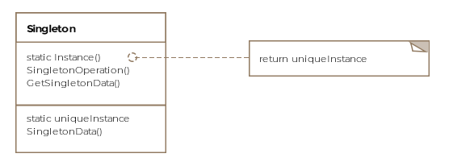

# Singleton - Object Creational

## Intent
Ensure a class only has one instance, and provide a global point of access to it

## Applicability
Use this pattern when:
* there must be exactly one instance of a class, and it must be accessible to clients from a well-known access point
* when the sole instance should be extensible by subclassing, and clients should be able to use an extended instance without modifying their code

## Structure

## Participants
* Singleton
  * defines an Instance operation that lets clients access its unique instance. Instance is a class operation (i.e., static method)
  * may be responsible for creating itis own unique instance

## Collaborations
* clients access a Singleton instance solely through Singleton's Instance operation

## Consequences
* Controlled access to sole instance
* Reduced name space
* Permits refinement of operations and representation
* Permits a variable number of instances
* More flexible than class operations

## Implementation
* Ensuring a unique instance
* Subclassing the Singleton class

## Related Patterns
* Abstract Factory
  * can be implemented using Singleton
* Builder
  * can be implemented using Singleton
* Prototype
  * can be implemented using Singleton